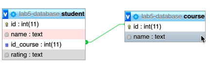

# Laboratorio de ORM con Hibernate
1. En este laboratorio el estudiante tiene que crear la base de datos a partir del diagrama E-R.
2. Desarrollar los modelos, el DAO para todo el CRUD (Create - Read - Update - Delete) y un test funcional que pruebe las diferentes acciones del CRUD utilizando **HIBERNATE como ORM de su aplicación**.

## Diagrama Entidad-Relación

